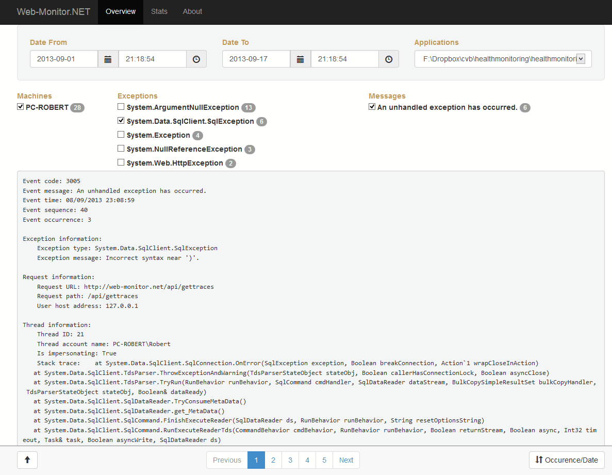

HealthMonitoring.NET
====================

###..it's comming

* Mobile ready responsive design, api access, and more thank's to: AngularJS, BootStrap 3 and ASP.NET MVC 5

###Includes different logging methods, so it can be retrofit to existing installations without any code modification. Or sites can be enhanced to log even more information.

* Server-Side Tracing
  * Just configure web.config and catch all errors from the framework & iis
     * works transparently withthout modifying existing installations or code
     * catches all 400-599 error codes complete with stacktrace, request url, and more
* Server-Side Logging
  * Trace custom errors inside your code
     * Requires a custom provider
     * Trace errors with complete stacktrace & custom object dumping
     * Provider is provided by this project
* Client-Side Logging
  * Catch and trace all errors from window.onerror & jQuery ajax requests
  * Trace custom exceptions
     * Provider is provided by this project

